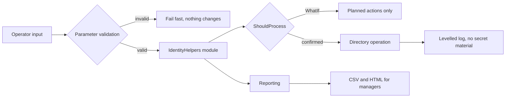

# Active Directory Automation

PowerShell lab for identity lifecycle, access review, privileged-account auditing and operational reporting.

This repository is designed as **security-focused engineering evidence**. It demonstrates safe automation patterns rather than claiming production deployment in any specific employer environment.

## Provenance

This automation suite was developed in 2026 from professional Windows administration
practice, and is published as portfolio work.

The identity data, domain names and site codes are synthetic, and the scripts are not
presented as having been executed against any production directory. Domains use the
reserved `example.com` space (RFC 2606); no organisation, host, site code or account
from any real environment appears in this repository.

## Runtime

The Active Directory scripts target **Windows PowerShell 5.1 on Windows**, with the
`ActiveDirectory` module available through the appropriate Windows Server role or RSAT
tooling. That is the environment these scripts are written for. In this repository,
Windows PowerShell 5.1 compatibility has been validated for parsing and character
handling; the Active Directory operations themselves have not been executed against
a live directory.

PowerShell 7 (`pwsh`) is used by CI to run the automated helper tests. The Active Directory
operations themselves have **not** been validated under PowerShell 7, and this repository
makes no claim that they are.

Script files that contain non-ASCII characters are stored as **UTF-8 with BOM**. Windows
PowerShell 5.1 reads a BOM-less UTF-8 file using the system ANSI code page, which corrupts
those characters and can break parsing; the BOM makes the encoding explicit. Do not strip
it.

## Security principles

- `Set-StrictMode -Version Latest` and terminating errors
- `SupportsShouldProcess` for privileged or destructive actions
- no reusable passwords or secrets committed to source
- temporary onboarding credentials supplied at runtime as `SecureString`
- pre-approved OUs only; onboarding does not create directory structure
- delegated OU/group permissions preferred over Domain Admin
- validation before privileged changes
- structured logging without secret material
- Pester coverage for testable helper logic

## Repository structure

```text
.
├── lifecycle/
│   ├── onboard-user.ps1
│   ├── offboard-user.ps1
│   └── transfer-user.ps1
├── access-management/
│   ├── access-review.ps1
│   ├── privileged-accounts-audit.ps1
│   └── stale-accounts-report.ps1
├── reporting/
│   ├── ad-health-report.ps1
│   ├── group-membership-report.ps1
│   └── password-policy-audit.ps1
├── lib/
│   └── IdentityHelpers.psm1
├── tests/
│   └── IdentityHelpers.Tests.ps1
└── docs/
```

## Secure onboarding example

```powershell
$tempPassword = Read-Host 'Temporary password' -AsSecureString

.\lifecycle\onboard-user.ps1 `
    -FirstName 'Jane' `
    -LastName 'Smith' `
    -Department 'Engineering' `
    -Site 'Dublin' `
    -Manager 'jdoe' `
    -Title 'IT Engineer' `
    -TemporaryPassword $tempPassword `
    -TicketReference 'REQ-2026-0042' `
    -WhatIf
```

Run with `-WhatIf` first. Remove it only after validating the target OU, groups, manager, ticket and delegated execution identity.

## Privilege model

Routine provisioning should use a **dedicated delegated identity** with only the permissions needed for the approved OUs and groups.

Recommended capabilities:

- create/update user objects only in approved user OUs;
- reset/set initial user password in those OUs;
- update the required user attributes;
- add/remove users only from approved operational groups;
- read manager, OU and group metadata required for validation.

Routine onboarding should **not** require Domain Admin, Enterprise Admin or broad directory-control permissions.

## Credential handling

The repository does not store a reusable onboarding password. The caller supplies a `SecureString` at runtime. In a production design, the runtime value should come from an approved privileged workflow or secret-management system and should never be logged or committed.

## Testing

The helper module is intentionally isolated from the Active Directory dependency so deterministic logic can be tested without a domain controller.

```powershell
Install-Module Pester -MinimumVersion 5.5.0 -Scope CurrentUser
Invoke-Pester ./tests
```

The suite uses Pester 5 syntax and requires **Pester 5.5.0 or later**. The Pester version
shipped with Windows (3.4.0) cannot run it. CI enforces the same minimum.

Current tests cover:

- SAMAccountName generation;
- punctuation/diacritic normalization;
- length enforcement;
- invalid input handling;
- log-safe identifier redaction.

## Operational workflows

### Lifecycle

- onboarding into approved OUs and groups;
- transfer between approved department/site structures;
- offboarding with account disablement and access removal.

### Access management

- access review reporting;
- privileged group/account audit;
- stale-account identification.

### Reporting

- AD health reporting;
- group-membership snapshots and delta comparison;
- password-policy audit.

## Failure model

Automation is considered unsafe if it silently continues after an identity-control failure. Scripts should stop or clearly surface failures when critical validation fails.

Examples:

- manager cannot be resolved;
- target OU is missing;
- required security group is missing;
- directory operation fails;
- delegated permissions are insufficient.

## Learning objectives

This lab is used to develop and demonstrate:

`PowerShell` · `Active Directory` · `IAM` · `Least Privilege` · `Identity Lifecycle` · `Access Review` · `Auditability` · `Pester`

## Next engineering steps

- expand Pester coverage to access-review and reporting helper functions;
- add Entra ID / Microsoft Graph equivalents as a separate, clearly scoped lab;
- model an approval boundary between HR/request intake and privileged execution;
- add structured JSON audit events for SIEM ingestion.


## Architecture



Directory-dependent logic is isolated inside the module so that the surrounding flows can be
exercised deterministically, without a live directory being present.

## Validation

| Layer | What it checks |
|---|---|
| Pester 5 unit tests | Module logic against controlled inputs |
| GitHub Actions CI | Test run on every push, `windows-latest`, `permissions: contents: read` |
| Strict mode | Undeclared variables fail rather than evaluating to empty |
| `ShouldProcess` | Every destructive path supports `-WhatIf` before it acts |
| Pre-approved scope | Operations are constrained to explicitly listed organisational units |

## Limitations

**These operations have not been executed against a live production directory.** The
repository is a laboratory build. Anyone adopting it should expect to validate behaviour in a
test forest first.

- Reporting is designed for review by a human, not for automated enforcement.
- Rollback for directory changes is not automated; the safeguard is `-WhatIf` before the fact.
- Test coverage targets the helper module, not end-to-end directory interaction.

## Lessons learned

A publication readiness gate on this repository failed on its first run and surfaced that
nine of eleven scripts did not parse, after they had been read and judged fine. The defect
was reduced to a four-case minimal reproduction and confirmed as pre-existing. The lesson
kept: code that looks right is not evidence, and a gate that never fails is not a gate.

## Future improvements

- Integration tests against a disposable test forest.
- Structured output for ingestion by a reporting pipeline.
- Signed releases once the repository is published.
